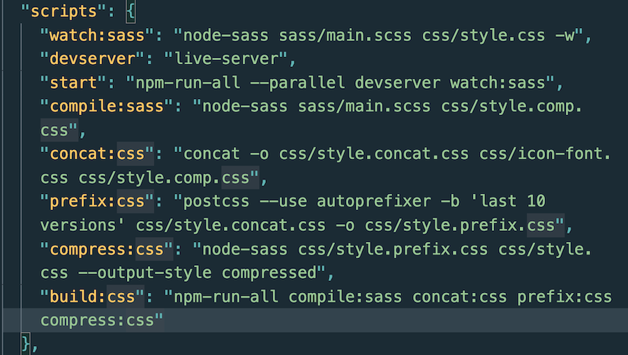

<!-- PROJECT SHIELDS -->

<!-- PROJECT LOGO -->
 
 

  

  <h3 align="center"><strong>Stars Unlimited</strong></h3>

  

        CSS3 & SCSS | Mock talent agency webpage
     
    <a href="https://github.com/RachelNapier/stars-unlimited"><strong>Explore the docs »</strong></a>
     
    <a href="https://rachelnapier.github.io/stars-unlimited">View Demo</a>
  

 
 

<!-- ABOUT -->

## <strong>About This Project:</strong>

A fully responsive, mock, 'talent agency' landing page; Incorporating, advanced CSS, SCSS BEM-methodology and 7-1 architecture. Also, various NPM scripts, variables & mixins are used throughout the code.
 
 

<strong>Desktop navigation version:</strong>

 
 

<strong>Mobile navigation version:</strong></
 

## <strong>Built With:</strong>

- [Sass](https://sass-lang.com/)

<strong>Sass</strong> is a stylesheet language that’s compiled to CSS. It allows you to use variables, nested rules, mixins, functions, and more, all with a fully CSS-compatible syntax. Sass helps keep large stylesheets well-organized and makes it easy to share design within and across projects.

<!-- GETTING STARTED -->

## <strong>Getting Started</strong>

Steps required first before downloading and utilizing <strong>Sass</strong>, see below. ⤵

- Requires Node.js to run: first install the current version of [Node.js](https://nodejs.org/en/).
- In your command line, utitlize <code>npm install</code> to install Node Sass and its' libararies.
  - <code>"npm install node-sass"</code>
  - <code>"npm install concat"</code>
  - <code>"npm install autoprefixer"</code>
  - <code>"npm install postcss-cli"</code>
  - <code>"npm install npm-run-all"</code>
- To save as a dev dependency, add <code>--save-dev</code> at the end of any installation, in the terminal.

Also, add in the required scripts into your <u>package.json</u> file, see example below ⤵

For more information on installing and setting up <strong>SASS</strong>, visit here → [Sass installation](https://sass-lang.com/install).

To understand some of the basics of Sass first, checkout this [Sass Guide](https://sass-lang.com/guide).

<!-- CONTRIBUTORS -->

## <strong>Contributors</strong>

Developed by: [Rachel Napier](https://github.com/RachelNapier) 
Design from: [Jonas Schmedtmann](https://www.udemy.com/user/jonasschmedtmann/) 
Images from: [Unsplash](https://unsplash.com/)

<!-- CONTACT -->

## <strong>Contact Me</strong>

Twitter: [@RachelNapier93](https://twitter.com/RachelNapier93) 
Github: [RachelNapier](https://github.com/RachelNapier) 
Gmail: napier.rachel93@gmail.com
